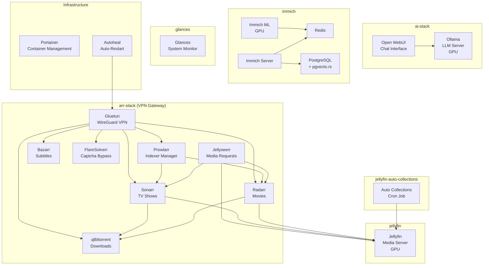

# Homelab

Self-hosted homelab running on Docker Compose, organized into independent stacks for media automation, AI inference, photo management, and system monitoring. All services route through a WireGuard VPN gateway for privacy, with autoheal ensuring containers recover from failures automatically. Secrets are kept out of version control via `.env` files and a pre-commit hook that blocks accidental credential leaks. Three stacks leverage NVIDIA GPU acceleration for hardware transcoding, machine learning, and LLM inference. Run `./setup.sh` to initialize the repo, install git hooks, and scaffold `.env` files from the provided templates.

## Architecture



## Stacks

| Stack | Services | GPU | Description |
|-------|----------|-----|-------------|
| **arr-stack** | Gluetun, Prowlarr, Sonarr, Radarr, Bazarr, qBittorrent, FlareSolverr, Jellyseerr | - | Full media automation pipeline behind a WireGuard VPN. Prowlarr manages indexers, Sonarr/Radarr grab content, qBittorrent downloads, and Bazarr fetches subtitles. |
| **jellyfin** | Jellyfin | NVIDIA | Media server with NVIDIA GPU hardware transcoding for smooth playback across devices. |
| **jellyfin-auto-collections** | Auto Collections | - | Cron job that automatically organizes Jellyfin libraries into curated collections daily at 4 AM. |
| **ai-stack** | Ollama, Open WebUI | NVIDIA | Local LLM inference with full GPU passthrough. Open WebUI provides a ChatGPT-like interface on top of Ollama. |
| **immich** | Immich Server, Immich ML, Redis, PostgreSQL | NVIDIA | Self-hosted Google Photos alternative. The ML service uses CUDA for face recognition, object detection, and smart search. |
| **glances** | Glances | - | Lightweight system monitoring dashboard with Docker container visibility. |
| **portainer** | Portainer CE | - | Web-based Docker management UI exposed on ports 9000/9443. |
| **autoheal** | Autoheal | - | Monitors containers with the `autoheal-app` label and restarts them if health checks fail. |

## Quick Start

```bash
git clone git@github.com:szymonrucinski/homelab.git
cd homelab
chmod +x setup.sh && ./setup.sh
# Edit each stack's .env file with your values, then:
cd arr-stack && docker compose up -d
```
